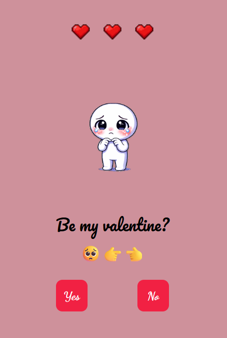
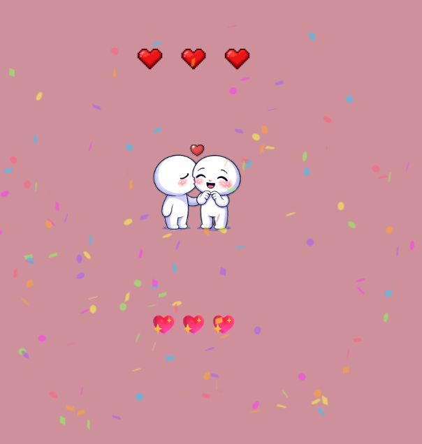
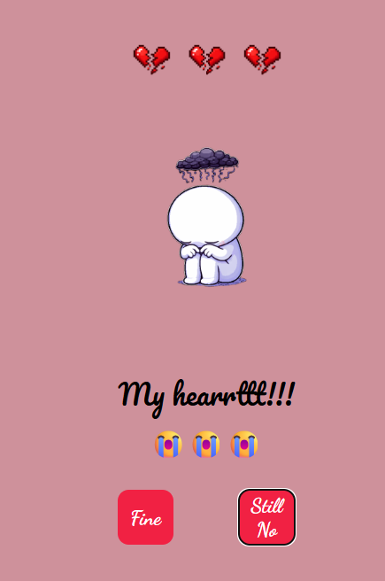

<h1>Project Valentine</h1>

<h3>Project Summary</h3>

This is a cute and simple valentine proposal web app that uses a cute game theme

<h3>Config Instructions:</h3>
<ol>
  <li>Download and Unzip file</li>
  <li>Install the "Live Server" extension (If not readily available)</li>
  <li>Click on "Go Live" at the bottom right of ur IDE</li>
</ol>

<h3>Tech Stack:</h3>
<ul>
  <li>HTML</li>
  <li>CSS</li>
  <li>Javascript</li>
</ul>

<h3>Demo</h3>

